<h1 align="center">🎣 Phishing Website Detection Using Optimised Machine Learning & Deep Learning</h1>

  <em>This project develops an enhanced phishing detection framework using a novel hybrid CNN + XGBoost architecture. It employs a Hybrid Ensemble Feature Selection (HEFS) methodology and compares tuned models such as Random Forest, XGBoost, CNN, and TCN via meta-learning layers to provide a robust solution for identifying malicious URLs.</em>

  
  
  
  
  

---

## 📑 Table of Contents
- [Overview](#-overview)
- [Key Features](#-key-features)
- [Architecture Diagram](#-architecture-diagram)
- [Methodology](#-methodology)
- [Dataset](#-dataset)
- [Results & Visualizations](#-results)
- [Environment & Libraries](#️-environment--libraries)
- [References](#-references)

---

## 📖 Overview

Phishing attacks have become increasingly sophisticated, often bypassing traditional blacklist-based detection systems. This project aims to develop a scalable, adaptive, and highly generalizable phishing detection framework. 

By addressing critical challenges such as limitations in feature selection, lack of structured model evaluation, and poor generalizability, this study proposes a **Hybrid Dual-Branch Architecture** combining **Convolutional Neural Networks (CNN)** and **eXtreme Gradient Boosting (XGBoost)**, augmented by a **Hybrid Ensemble Feature Selection (HEFS)** strategy.

---

## ✨ Key Features

* **Hybrid Ensemble Feature Selection (HEFS):** Combines Mutual Information (MI), Random Forest Feature Importance, and Permutation Importance to select the most informative, non-redundant features, reducing the dataset's dimensionality by over 60% without compromising accuracy.
* **Dual-Branch Hybrid Architecture:** Integrates a representation-learning CNN with an XGBoost classifier, using a dual-stage Meta-MLP (Multi-Layer Perceptron) fusion layer to learn complementary decision behaviors.
* **Statistically Rigorous Evaluation:** To eliminate random initialization bias, all baseline and hybrid models were rigorously evaluated using **10-fold stratified cross-validation repeated across 30 independent random seeds** (resulting in 300 evaluation runs per model).
* **Cross-Dataset Generalization:** Rigorously tested on multiple datasets to ensure the models don't just memorize one distribution but perform effectively on unseen, real-world phishing data.
* **Low False Positive Rate (FPR):** Specifically optimized to reduce false alarms while maintaining an exceptionally high recall rate.

---

## ✨ Architecture Diagram

  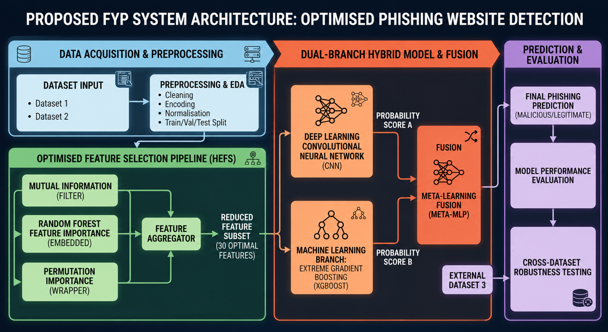

  <em>Figure 1. Overall architecture of the proposed phishing website detection framework.</em>

The proposed framework begins with **data preprocessing**, where missing values, duplicate records, single-valued columns, problematic binary columns, outliers and low-variance features are handled to improve data quality. The cleaned dataset is then processed by the **Hybrid Ensemble Feature Selection (HEFS)** module, which combines Mutual Information, Random Forest Feature Importance, and Permutation Importance to select the most informative features.

The selected features are simultaneously fed into two learning branches: a **Convolutional Neural Network (CNN)** for deep feature representation and an **XGBoost** classifier for gradient-boosted decision learning. The probability outputs from both branches are fused through a **dual-stage Meta-MLP** network, producing the final phishing website classification.

---
---

## 🧠 Methodology

1. **Data Preprocessing:** Handled missing/duplicate values, dropped single-valued/defective binary columns, applied Isolation Forest for outlier detection, and removed highly correlated features.
2. **HEFS Pipeline:** Extracted the top-tier features based on a weighted rank aggregation of MI, RF Importance, and Permutation Importance.
3. **Multi-Seed Benchmarking:** Benchmarked 6 ML models (RF, XGBoost, LR, Linear SVC, k-NN, LightGBM) and 4 DL models (FNN, CNN, TCN, LSTM). Every model was tested across 30 random seeds using 10-fold stratified CV to guarantee statistical reliability.
4. **Hybridization:** Passed the HEFS-optimized features through a CNN and XGBoost independently. The probability outputs from both models were combined into a meta-feature space and fed into two residual Meta-MLP models to generate the final prediction.

---

## 📊 Dataset

The project relies on benchmark datasets from the **Mendeley Data repository**:

* **Dataset 1:** Mendeley Phishing Websites Dataset 2020 (58,645 instances, 111 numerical features).   🔗 **DOI:** [`10.17632/72ptz43s9v.1`](https://doi.org/10.17632/72ptz43s9v.1)
* **Dataset 2:** Mendeley Web page phishing detection 2021 (11,430 URLs with 87 extracted features). *Used as the validation dataset for strict benchmark testing.*   🔗 **DOI:** [`10.17632/c2gw7fy2j4.3`](https://doi.org/10.17632/c2gw7fy2j4.3)
* **Dataset 3:** Mendeley Phishing Websites Dataset 2020 (88,647 instances, 111 numerical features). *Used to test Hypothesis 3: cross-dataset generalisation.*   🔗 **DOI:** [`10.17632/72ptz43s9v.1`](https://doi.org/10.17632/72ptz43s9v.1)

---

## 📈 Results

The proposed **CNN + XGBoost Hybrid Model** consistently outperformed all standalone base models and published benchmark architectures across all 300 evaluation runs.

- 🎯 **High Accuracy & F1-Score:** Achieved state-of-the-art accuracy (96.31%) on the benchmark datasets.
- 🛡️ **Low FPR:** Effectively minimized the false positive rate (3.59%), making it a viable solution for real-world browser extensions or traffic filters.
- 🌍 **Generalizability:** Demonstrated excellent transferability (AUC-ROC > 0.99) when trained on one dataset and tested entirely on an external dataset.

### 🖼️ Visual Performance

#### Dataset 1: Benchmark Testing

<b>Click to view Dataset 1 Results</b>

 

  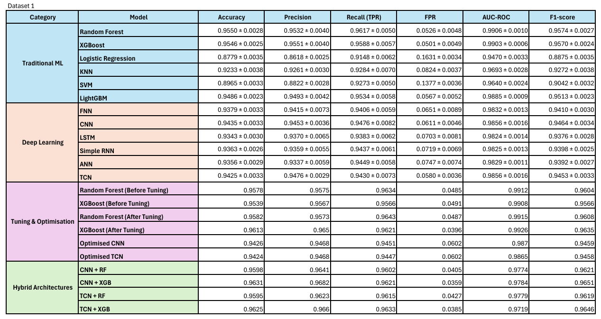 
  <em>Figure 2. Overall benchmarking results for Dataset 1.</em>

  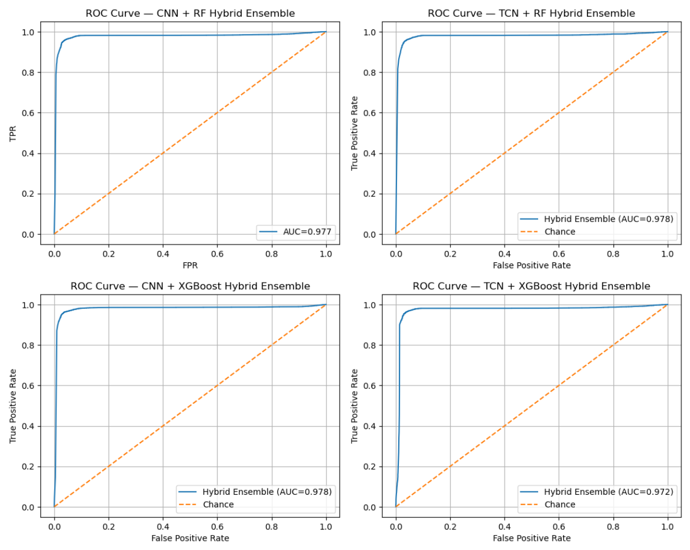 
  <em>Figure 3. ROC curve of the proposed CNN + XGBoost hybrid model on Dataset 1.</em>

  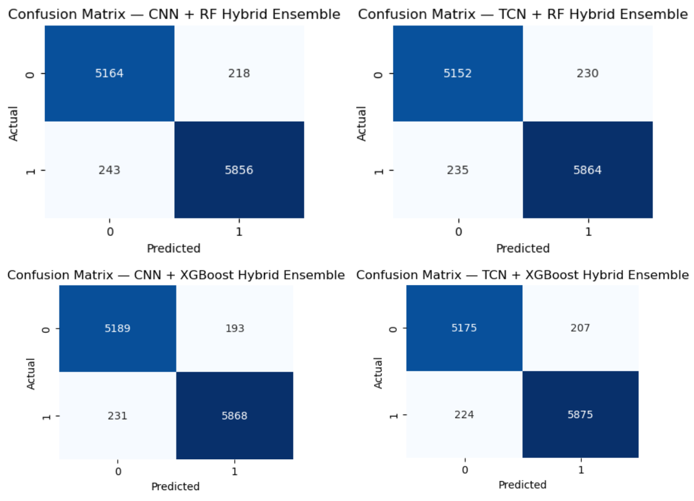 
  <em>Figure 4. Confusion matrix of the proposed CNN + XGBoost hybrid model on Dataset 1.</em>

  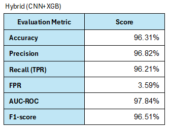 
  <em>Figure 5. Performance metrics of the proposed model on Dataset 1.</em>

  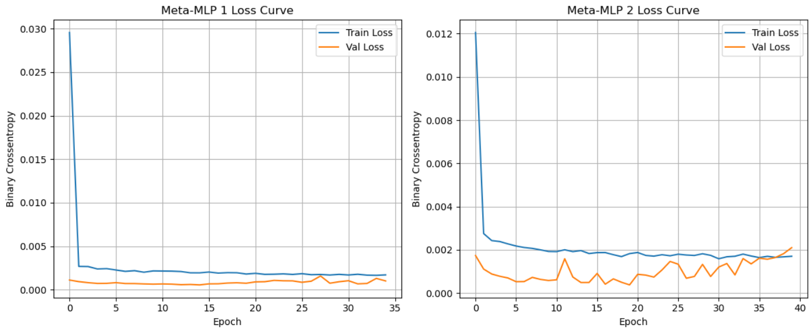 
  <em>Figure 6. Training and validation loss curves of the proposed model.</em>

  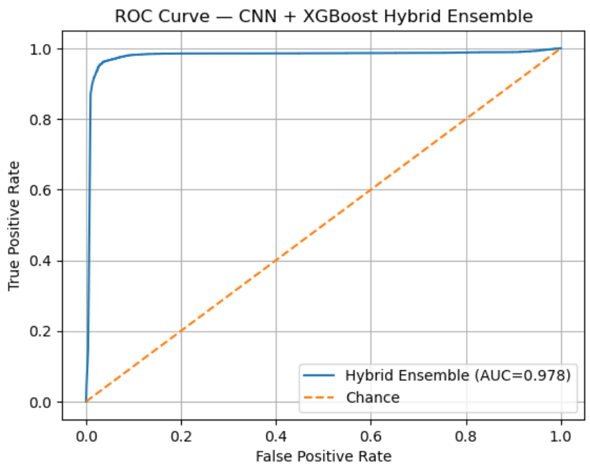 
  <em>Figure 7. ROC curve of the proposed model.</em>

  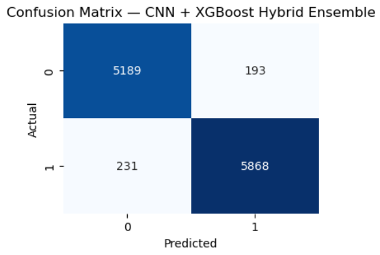 
  <em>Figure 8. Confusion matrix of the proposed model.</em>

#### Dataset 2: Validation

<b>Click to view Dataset 2 Results</b>

 

  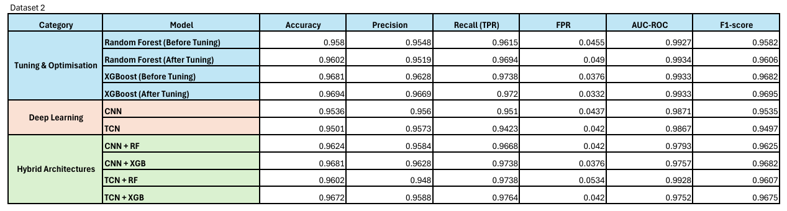 
  <em>Figure 9. Overall validation results for Dataset 2.</em>

  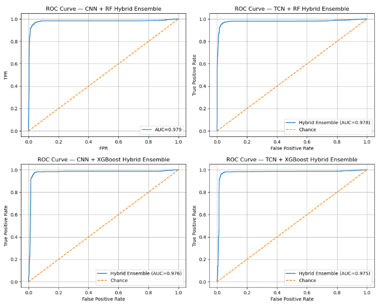 
  <em>Figure 10. ROC curve of the proposed CNN + XGBoost hybrid model on Dataset 2.</em>

  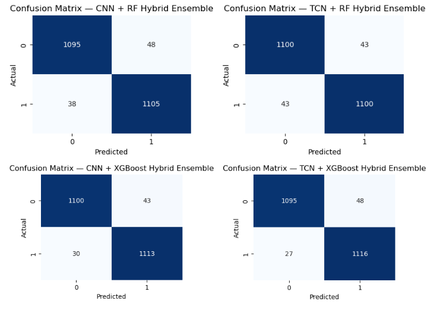 
  <em>Figure 11. Confusion matrix of the proposed CNN + XGBoost hybrid model on Dataset 2.</em>

#### Dataset 3: Cross-Dataset Generalization

<b>Click to view Dataset 3 Results</b>

 

  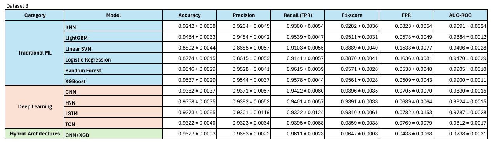 
  <em>Figure 12. Overall cross-dataset generalization results for Dataset 3.</em>

  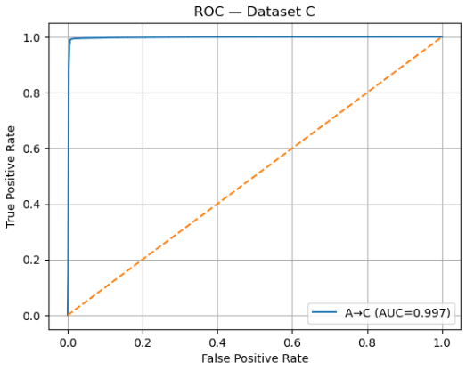 
  <em>Figure 13. ROC curve of the proposed CNN + XGBoost hybrid model on Dataset 3.</em>

  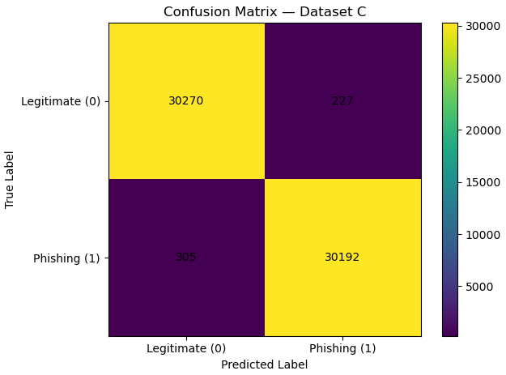 
  <em>Figure 14. Confusion matrix of the proposed CNN + XGBoost hybrid model on Dataset 3.</em>

---

## 🛠️ Environment & Libraries

The experiments were run in a Jupyter Notebook environment. The platform summary below captures the exact setup used for the project:

| Setting / Library | Value / Version |
|-------------------|-----------------|
| **Programming Language** | Python |
| **Python Version** | 3.12.3 |
| **Environment** | Jupyter Notebook |
| **pandas** | 2.2.3 |
| **numpy** | 1.26.4 |
| **matplotlib** | 3.9.2 |
| **seaborn** | 0.13.2 |
| **scikit-learn** | 1.7.2 |
| **xgboost** | 2.1.4 |
| **lightgbm** | 4.6.0 |
| **tensorflow** | 2.20.0 |
| **keras** | 3.11.3 |

---

## 📚 References

* Nayak, G. S., Muniyal, B., & Belavagi, M. C. (2025). *Enhancing Phishing Detection: A Machine Learning Approach with Feature Selection and Deep Learning Models.*
